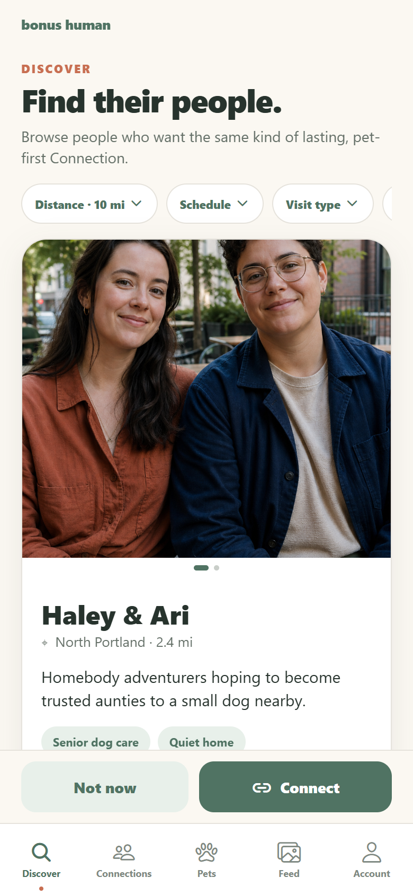
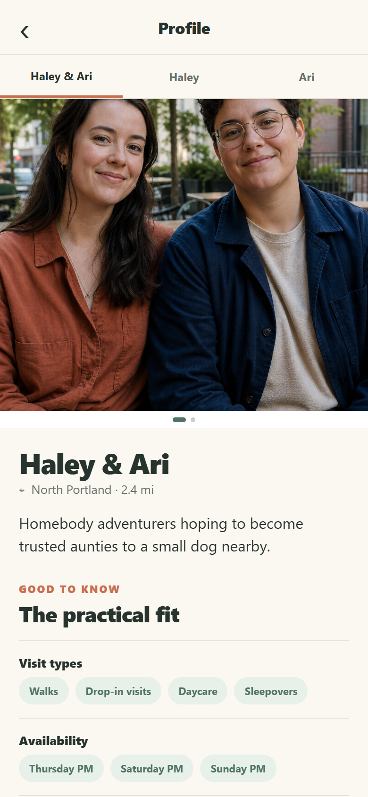
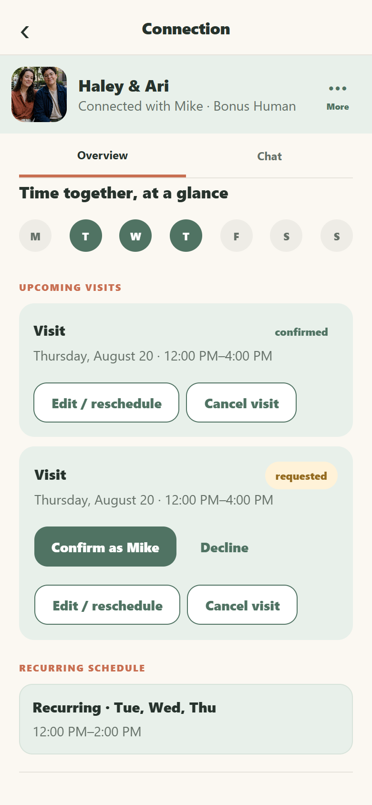

# Bonus Human

Bonus Human is an AI-assisted working prototype for building pet-sharing relationships between Pet Owners and people who want animals in their lives without taking on full-time ownership. It explores ongoing relationships rather than paid pet care.

<p align="center">
  
</p>

## Why this exists

As Zuki grew older, her changing care needs made personalized, consistent support more important than a typical sitting arrangement could always provide. At the same time, Mike met people nearby who liked the idea of a part-time pet. He tested that premise manually through Facebook, Nextdoor, flyers, and conversations with more than a dozen people.

Those conversations shaped the product question: how might nearby people find a compatible fit, build trust, coordinate care, and form an ongoing “bonus human” relationship?

## Product model

- People discover nearby Pet Owners or Bonus Humans using compatibility details and filters.
- Sending a request records one person’s intent; mutual requests create a connection.
- One connection persists as trust progresses through **Meet & Greet → Trial Visit → Bonus Human**.
- Messaging, scheduling, care information, and pet updates stay in the pet and connection context.
- The intended outcome is an ongoing pet-sharing relationship, not a one-time transaction.

## Prototype flow

**Discover → mutual request → connection → Meet & Greet → Trial Visit → Bonus Human**

Discover includes Pet Owner and Bonus Human modes, profile browsing, compatibility filters, reversible requests, and reversible **Not now** choices. Once interest is mutual, the connection provides a shared place to coordinate and advance through the trust stages.

<p align="center">
  
</p>
<p align="center"><em>Discover nearby people based on compatibility.</em></p>

## Core experiences

- **Scheduling:** recurring schedules, one-off visits, and a compact current-week view.
- **Care:** Zuki’s routine, food, medication, veterinary details, and emergency information.
- **Pet Feed + Chat:** a feed for private pet-centered photos and updates, plus chat for coordination and details.

<p align="center">
  
</p>
<p align="center"><em>Scheduling supports recurring and one-off visits.</em></p>

## Implementation

The prototype uses React Native, Expo SDK 54, React, and mocked local state. OpenAI Codex supported the implementation workflow while Mike directed the product model, scope, UX decisions, review cycles, and quality bar.

Validation includes 42 automated regression tests with Jest and React Native Testing Library, repeated physical-iPhone QA in Expo Go, and a repeatable Playwright-based visual-review workflow that produces consistent PNG, SVG, contact-sheet, and PDF artifacts.

The current product and visual decisions are documented in [PRODUCT_DESIGN.md](PRODUCT_DESIGN.md), [DESIGN_SYSTEM.md](DESIGN_SYSTEM.md), and [PRODUCT_BACKLOG.md](PRODUCT_BACKLOG.md).

## What changed through testing

- A separate Relationship object was removed in favor of one long-lived connection whose stage changes over time.
- One-off visits were separated from recurring schedules so occasional and ongoing time remain distinct.
- Previous/Next profile browsing was limited to Discover; known-profile and established-connection contexts use scoped navigation.
- Request and lifecycle language was clarified so one request remains pending and only mutual intent creates a connection.

## Deliberate boundaries

This portfolio prototype deliberately excludes:

- production authentication and backend services
- payments
- a full calendar visualization
- scheduling conflict detection
- full pet-record creation and editing

It also does not provide production messaging, notifications, or location tracking. Data is mocked locally and state resets when the app reloads.

## Running locally

Install Node.js 20.19 or newer and Expo Go, then run:

```bash
npm install
npx expo start --clear
```

On Windows PowerShell, use `npm.cmd install` and `npx.cmd expo start --clear` if script aliases are unavailable. Scan the QR code with Expo Go or press `w` for the web preview.

Regenerate the visual-review artifacts with:

```bash
npm run visual-review
```

## Tests

Run all 42 regression tests with:

```bash
npm test
```

On Windows PowerShell, use `npm.cmd test` and `npm.cmd run visual-review`.

© 2026 Mike Vais. All rights reserved.
